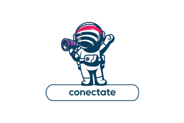

***
# __*Hola, soy Franco, emprendedor*__
## Soy un desarrollador rookie 💻 que está aprendiendo Python 🐍 y otros lenguajes. Tengo una gran pasión por las redes informáticas 🌐 y ¡he creado mi propio ISP! 🚀 También tengo una industria gráfica 🎨 que me encanta. ¡Vamos por más! 🎉

***
Tabla de contenido:

- [Sobre mi](#poco)
- [Mail](#mail)
- [Link a TecoNET](#web)


***
>
## - *Un poco sobre mi* :
>
### - Propietario en TecoNET
#### *Internet & Redes*
- Proveedor de servicios de internet
- Creador o constructor de estructuras para redes locales.

### - Propietario en Grafica LUMA
#### * Diseño e impresion *
- Diseños de carteleria, impresion e instalaciones
- Gestion comercial y administrativa.
>
***
| Cantidad | Descripcion | Precio |
| -------- | ----------- | ------ |
| 1        | Taza        | $100   |
| 2        | Taza        | $200   |
| 3        | Taza        | $300   |
---

```python

def pepa() :
    print ("Tengo una perra que se llama Pepa")
```


***
# *Pagina Web TecoNET* :
[ Ir a mi pagina web de TecoNET ](https://www.teconet.com.ar)


## *Mail*
## francoaguado@gmail.com